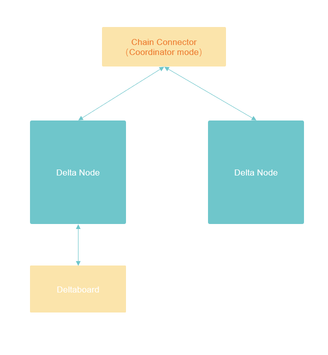

# Delta All-in-One Network Start Script

This repository contains the docker-compose start script and other necessary config files to start a minimum Delta network in the following structure:



The minimum network contains a Chain Connector instance running at coordinator mode, 2 Delta Nodes contains test MNIST data, and a Deltaboard instance.
To start the network, clone this repository in your local environment:

```
$ git clone https://github.com/delta-mpc/delta-all-in-one.git
```

Then use docker-compose to start the network:

```
$ cd delta-all-in-one
$ docker-compose up -d
```

After downloading the image and starting the container, we can already visit Deltaboard in the browser through:

```
http://localhost:8090
```

